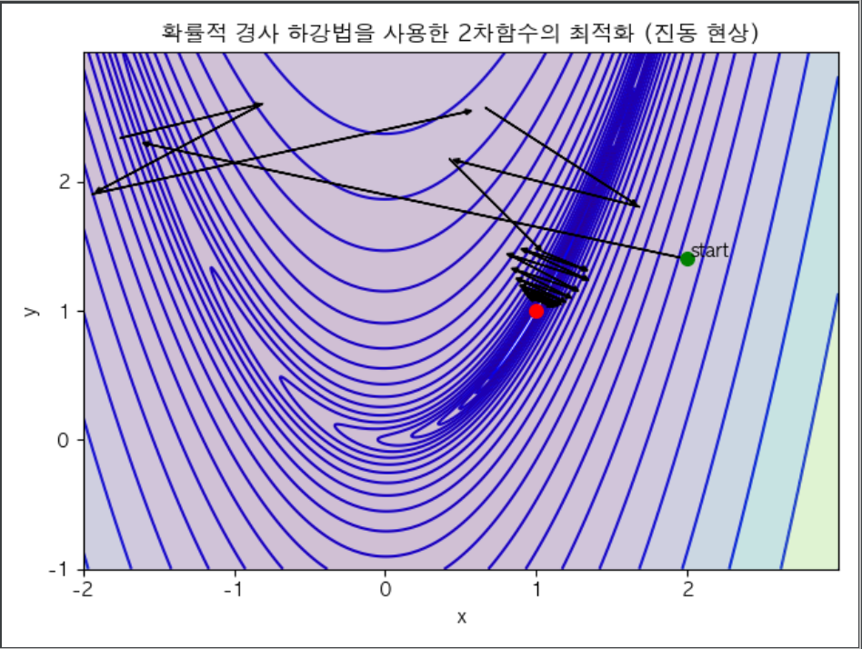
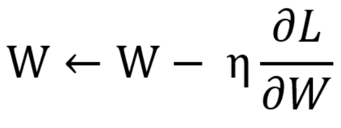

# SGD-optimizer
Visualizing optimization with rosenbrock function using stochastic gradient descent and matplotlib

### 경사하강법

함수의 기울기를 낮은 쪽으로 이동시켜 극값에 이를 때 까지 반복시키는 법이다. 우리는 이 방법을 통해비용 함수를 최소화하는 최적 파라미터를 찾는것이 목표이다. 

### 경사하강법의 문제점
경사 하강법은 전체 데이터셋을 이용한다. 하지만 그 데이터 셋이 수십억 내지는 수천억개가 존재 할 수 있으며 특성(feature) 또한 다양해 진다.
이 데이터 셋을 ‘배치(batch)’ 라고 하는데 배치가 너무 커지면 계산하는데 많은 시간이 걸릴 수 있다.
만약 상대적으로 적은 계산으로 최적의 기울기를 얻을 수 있다면 어떠할까? 
이러한 문제점을 극복할 수 있는 최적화 알고리즘 중 하나인 Stochastic gradient descent(확률적 경사 하강법) 에 대해 기술 하려 한다.

확률적 경사 하강법은 배치 크기가 1인 경사하강법 알고리즘이다. 
추출된 데이터 1개 에 경사하강법을 적용하며 그 데이터는 무작위로 선택된다.
위 사진 처럼 노이즈가 많아서 기울기가 최소가 되기 까지는 많은 반복 수가 필요하지만 기존 경사하강법 알고리즘보다 계산이 빠르다는 장점이 있다.
  
- 아래 사진은 프로그램 최종 실행 결과

### 확률적 경사하강법(SGD) 의 동작 원리
의외로 간단하다 공식은 경사하강법과 같으며, 중요한점은 batch size가 1이다.( 일부 데이터셋만을 활용한다는 뜻.)

- W: weight
- η(에타): 학습률, step_size
- δL/δW: 기울기(미분값)

이라 할때 다음 공식을 이용하면 SGD를 구현할수 있다.

## 프로젝트 구조 설명

- SGD.py - scipy 라이브러리를 이용하여 SGD를 구현하였습니다.
- SGDtest.py - SGD.py 의 unittest 입니다.
- SGDImplement.py - SGD 알고리즘을 직접 구체화 해본 SGDImplement 클래스가 존재합니다. 로젠브록 함수 최적화를 진행합니다.
- SGDImplementtest.py - SGDImplement.py 의 unittest 입니다.
- SGDImplementVisualizer.py - SGDImplement 에 matplotlib 의 plot 기능을 통해 시각화 기능을 추가 했습니다. 마찬가지로 로젠브록 함수 최적화하였습니다. SGDImplement를 변형한 클래스인 SGDVisualizer 가 존재합니다. 
- SGDImplementVisualizertest.py - SGDImplementVisualizer.py 의 unittest 입니다.

